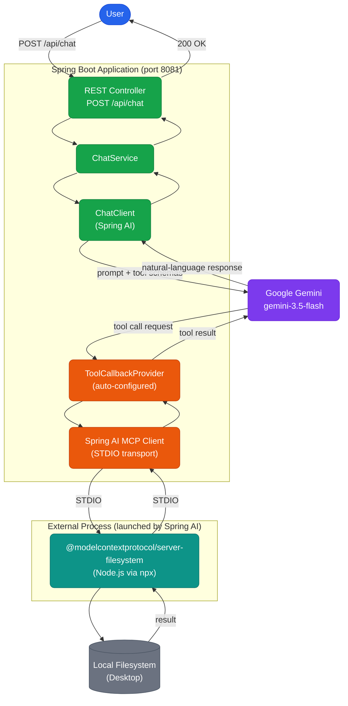
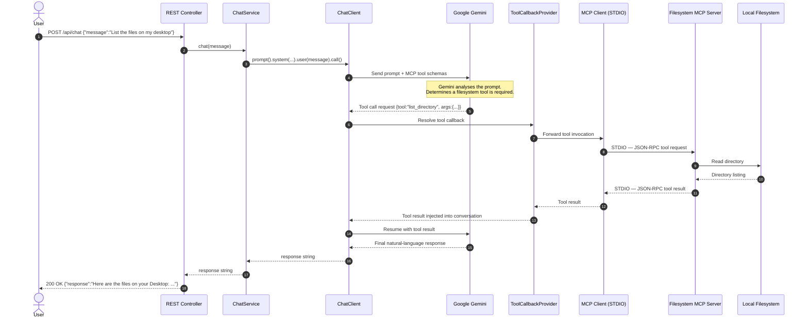

# Spring AI MCP Filesystem Client

A Spring Boot application that integrates **Google Gemini** with the **Model Context Protocol (MCP)** to give an LLM controlled, natural-language access to the local filesystem. The user sends plain-English requests through a REST API; Gemini autonomously decides when and how to invoke the filesystem tools exposed by an external MCP server.

---


---

## Table of Contents

1. [Overview](#overview)
2. [Key Features](#key-features)
3. [Architecture](#architecture)
4. [Request Flow](#request-flow)
5. [MCP Concepts](#mcp-concepts)
6. [Project Structure](#project-structure)
7. [Technology Stack](#technology-stack)
8. [Configuration](#configuration)
   - [Environment Variables](#environment-variables)
   - [MCP Server Configuration](#mcp-server-configuration)
9. [Running the Application](#running-the-application)
10. [REST API](#rest-api)
11. [Example Requests](#example-requests)
12. [Tool Calling Flow](#tool-calling-flow)
13. [Error Handling](#error-handling)
14. [Security Considerations](#security-considerations)
15. [Troubleshooting](#troubleshooting)
16. [Future Improvements](#future-improvements)
17. [Learning Outcomes](#learning-outcomes)
18. [License](#license)

---

## Overview

This project demonstrates how a Spring Boot application can act as an **MCP Client** — bridging a large language model (Google Gemini) with real external capabilities through the Model Context Protocol.

The application does **not** implement any filesystem logic in Java. Instead, it delegates all filesystem operations to an external Node.js MCP server (`@modelcontextprotocol/server-filesystem`) that is launched automatically at startup over **STDIO transport**. Gemini receives the list of available MCP tools and decides, autonomously, whether a tool call is required for a given user request.

This separation of concerns means the Spring Boot application stays clean and language-model-agnostic. Swapping the MCP server or the underlying LLM requires minimal code changes.

---

## Key Features

- **Natural-language filesystem control** — users interact in plain English, not through file-picker UIs or command lines.
- **Autonomous tool selection by Gemini** — the LLM decides when and which MCP tool to invoke; the user never manually selects tools.
- **Zero Java File API usage** — all filesystem operations are performed by the external MCP server.
- **STDIO-based MCP transport** — the MCP client communicates with the server through standard input/output streams; no sockets or HTTP are involved in the MCP layer.
- **Automatic MCP server lifecycle** — Spring AI launches the Node.js process on startup using the `mcp-servers.json` configuration; no manual process management is required.
- **Structured error responses** — a global exception handler translates all failures into safe, structured JSON without leaking stack traces.
- **Principle of least privilege** — the MCP server is restricted to a single allowed directory configured at startup.

---

## Architecture

The diagram below shows the high-level boundaries: components inside the Spring Boot process, the external MCP server process, and the local filesystem.



---

## Request Flow

The sequence diagram below traces a single request from the user through every layer of the system.



---

## MCP Concepts

The **Model Context Protocol** defines a standard interface between LLM applications and external capability providers. The AI application (the *MCP Client*) does not need to know how a capability is implemented — it only needs to know what tools are available and how to call them. The implementation details live entirely inside the *MCP Server*.

```mermaid
flowchart LR
    classDef aiLayer  fill:#7C3AED,stroke:#6D28D9,color:#fff,rx:6
    classDef mcpLayer fill:#EA580C,stroke:#C2410C,color:#fff,rx:6
    classDef extMcp   fill:#0D9488,stroke:#0F766E,color:#fff,rx:6
    classDef fsLayer  fill:#6B7280,stroke:#4B5563,color:#fff,rx:6

    LLM["LLM\n(Google Gemini)"]:::aiLayer
    CLT["MCP Client\n(Spring AI)"]:::mcpLayer
    PRO["MCP Protocol\n(JSON-RPC over STDIO)"]:::mcpLayer
    SRV["MCP Server\n(@modelcontextprotocol/server-filesystem)"]:::extMcp
    TLS["Exposed Tools\nlist_directory · read_file\ncreate_file · move_file · delete_file"]:::extMcp
    RES[("Local Filesystem")]:::fsLayer

    LLM <-->|"tool schemas + calls"| CLT
    CLT <-->|"JSON-RPC messages"| PRO
    PRO <-->|"over STDIO"| SRV
    SRV --> TLS
    TLS <--> RES
```



| Concept | This Project |
|---|---|
| MCP Client | Spring Boot application (`spring-ai-starter-mcp-client`) |
| MCP Server | `@modelcontextprotocol/server-filesystem` Node.js package |
| Transport | STDIO — Spring Boot spawns the Node.js process as a child |
| Tool Provider | `ToolCallbackProvider` (auto-configured by Spring AI) |
| LLM | Google Gemini (`gemini-3.5-flash`) |
| External Resource | Local filesystem (restricted to one directory) |

---

## Project Structure

```
src/
├── main/
│   ├── java/com/panduranga/Mcp_client/
│   │   ├── McpClientApplication.java          ← Spring Boot entry point
│   │   ├── config/
│   │   │   └── ChatClientConfig.java          ← Wires ChatClient + ToolCallbackProvider
│   │   ├── controller/
│   │   │   └── ChatController.java            ← POST /api/chat endpoint
│   │   ├── service/
│   │   │   └── ChatService.java               ← Builds prompt, validates input, calls Gemini
│   │   ├── dto/
│   │   │   ├── ChatRequest.java               ← Record: { String message }
│   │   │   └── ChatResponse.java              ← Record: { String response }
│   │   └── exception/
│   │       ├── InvalidMessageException.java   ← Thrown for null/blank messages
│   │       └── GlobalExceptionHandler.java    ← @RestControllerAdvice; structured errors
│   └── resources/
│       ├── application.properties             ← All Spring / AI / MCP configuration
│       └── mcp-servers.json                   ← Defines the MCP server to launch
└── test/
    └── java/com/panduranga/Mcp_client/
        └── McpClientApplicationTests.java
```

### Component Responsibilities

| Class | Responsibility |
|---|---|
| `ChatClientConfig` | `@Configuration` — builds the `ChatClient` bean and registers `ToolCallbackProvider` as the default tool source. Injects the interface (not the concrete `SyncMcpToolCallbackProvider`) to avoid Spring Boot 4.x classloading issues. |
| `ChatController` | Thin REST layer — delegates entirely to `ChatService` and wraps the result in a `ChatResponse` record. |
| `ChatService` | Constructs the ChatClient prompt with a system prompt and user message, invokes Gemini, and validates that the input is not null or blank. |
| `GlobalExceptionHandler` | Catches `InvalidMessageException` (400) and all other exceptions (500). Returns structured JSON without stack traces. |
| `mcp-servers.json` | Claude Desktop-compatible config Spring AI reads at startup to spawn MCP servers via STDIO. |

---

## Technology Stack

| Layer | Technology | Version |
|---|---|---|
| Language | Java | 21 |
| Framework | Spring Boot | 4.1.1 |
| AI Framework | Spring AI | 2.0.1 |
| LLM | Google Gemini (`gemini-3.5-flash`) | via Google GenAI API |
| MCP Client dependency | `spring-ai-starter-mcp-client` | 2.0.1 |
| MCP Server | `@modelcontextprotocol/server-filesystem` | via `npx` |
| MCP Transport | STDIO | — |
| Web | Spring Web MVC | managed by Spring Boot |
| Build | Apache Maven | 3.x |
| MCP server runtime | Node.js / npx | ≥ 18 |

---

## Configuration

### Environment Variables

The Gemini API key is read exclusively from an environment variable. **Never commit it to source control.**

| Variable | Required | Description |
|---|---|---|
| `GOOGLE_API_KEY` | Yes | Google AI Studio / Gemini API key |

**PowerShell — session-scoped:**

```powershell
$env:GOOGLE_API_KEY = "your-api-key-here"
```

**PowerShell — persistent (user-scoped):**

```powershell
[System.Environment]::SetEnvironmentVariable("GOOGLE_API_KEY", "your-api-key-here", "User")
```

**IntelliJ IDEA:**
> Run → Edit Configurations → Environment variables → add `GOOGLE_API_KEY=your-api-key-here`

### `application.properties`

```properties
spring.application.name=mcp-filesystem-client
server.port=8081

# Google Gemini
spring.ai.google.genai.api-key=${GOOGLE_API_KEY}
spring.ai.google.genai.chat.options.model=gemini-3.5-flash

# Spring AI MCP Client — STDIO transport
spring.ai.mcp.client.enabled=true
spring.ai.mcp.client.type=SYNC
spring.ai.mcp.client.request-timeout=60s
spring.ai.mcp.client.toolcallback.enabled=true
spring.ai.mcp.client.stdio.servers-configuration=classpath:mcp-servers.json

# Logging
logging.level.root=INFO
logging.level.com.panduranga=DEBUG
logging.level.org.springframework.ai=DEBUG
logging.level.io.modelcontextprotocol=DEBUG
```

### MCP Server Configuration

`src/main/resources/mcp-servers.json` uses the same format as Claude Desktop. Spring AI reads this file at startup and spawns each listed server as a child process.

```json
{
  "mcpServers": {
    "filesystem": {
      "command": "cmd",
      "args": [
        "/c",
        "npx",
        "-y",
        "@modelcontextprotocol/server-filesystem",
        "C:/Users/YOUR_USERNAME/Desktop"
      ]
    }
  }
}
```

> **Important:** Replace `YOUR_USERNAME` with your actual Windows username. The MCP server will **only** permit operations inside this directory.

**Why `cmd /c npx ...` on Windows?**
`npx` on Windows is a `.cmd` batch wrapper — Java's `ProcessBuilder` cannot execute it directly. Routing through `cmd.exe /c` lets the Windows command interpreter handle the dispatch correctly.

---

## Running the Application

### Prerequisites

| Requirement | Version |
|---|---|
| JDK | 21 |
| Maven | 3.6+ |
| Node.js / npx | ≥ 18 |
| `GOOGLE_API_KEY` | Set as an environment variable |

### Steps

```bash
# 1. Clone
git clone https://github.com/YOUR_USERNAME/Mcp_client.git
cd Mcp_client

# 2. Set API key (PowerShell)
$env:GOOGLE_API_KEY = "your-api-key-here"

# 3. Update mcp-servers.json with your allowed directory path

# 4. Build
./mvnw clean package -DskipTests

# 5. Run
./mvnw spring-boot:run
```

On first run, npx may download `@modelcontextprotocol/server-filesystem` from the npm registry. Subsequent runs use the npm cache and start faster.

The application listens on **`http://localhost:8081`**.

---

## REST API

### `POST /api/chat`

**Request**

```http
POST /api/chat
Content-Type: application/json

{
  "message": "List the files on my desktop"
}
```

**Response — 200 OK**

```json
{
  "response": "Here are the files on your Desktop:\n\n- notes.txt\n- report.pdf\n- todo.txt"
}
```

**Response — 400 Bad Request** *(null or blank message)*

```json
{
  "error": "Chat message must not be null or blank."
}
```

**Response — 500 Internal Server Error** *(MCP or Gemini failure)*

```json
{
  "error": "Failed to communicate with the Filesystem MCP server. Ensure Node.js and npx are installed and the allowed directory in mcp-servers.json is accessible."
}
```

### HTTP Status Codes

| Status | Cause |
|---|---|
| `200 OK` | Gemini responded successfully (with or without tool calls) |
| `400 Bad Request` | Message field is null or blank |
| `500 Internal Server Error` | Gemini API failure, MCP failure, timeout, or permission error |

---

## Example Requests

```bash
# List files
curl -X POST http://localhost:8081/api/chat \
  -H "Content-Type: application/json" \
  -d "{\"message\": \"List the files on my desktop\"}"

# Read a file
curl -X POST http://localhost:8081/api/chat \
  -H "Content-Type: application/json" \
  -d "{\"message\": \"Read the contents of notes.txt\"}"

# Create a file
curl -X POST http://localhost:8081/api/chat \
  -H "Content-Type: application/json" \
  -d "{\"message\": \"Create a file called todo.txt with the content: Buy groceries\"}"

# Rename a file
curl -X POST http://localhost:8081/api/chat \
  -H "Content-Type: application/json" \
  -d "{\"message\": \"Rename notes.txt to old-notes.txt\"}"

# Move a file
curl -X POST http://localhost:8081/api/chat \
  -H "Content-Type: application/json" \
  -d "{\"message\": \"Move report.pdf to the Documents folder\"}"

# Delete a file
curl -X POST http://localhost:8081/api/chat \
  -H "Content-Type: application/json" \
  -d "{\"message\": \"Delete temporary.txt\"}"
```

---

## Tool Calling Flow

A key concept demonstrated here is **autonomous tool selection by the LLM**. The user does not choose which tool to call — Gemini does.

When Spring AI sends the prompt to Gemini, it also sends the **schemas of all available MCP tools** (names, descriptions, input parameters). Gemini uses this to decide whether a tool call is needed and, if so, which tool to invoke and with what arguments.

```mermaid
flowchart TD
    classDef userLayer fill:#2563EB,stroke:#1D4ED8,color:#fff,rx:8
    classDef aiLayer   fill:#7C3AED,stroke:#6D28D9,color:#fff,rx:8
    classDef mcpLayer  fill:#EA580C,stroke:#C2410C,color:#fff,rx:8
    classDef extMcp    fill:#0D9488,stroke:#0F766E,color:#fff,rx:8
    classDef decision  fill:#D97706,stroke:#B45309,color:#fff,rx:8

    A(["User message received"]):::userLayer
    B["ChatClient sends\nprompt + MCP tool schemas"]:::aiLayer
    C["Gemini analyses prompt"]:::aiLayer
    D{"Filesystem operation\nrequired?"}:::decision
    E["Gemini issues tool call\ne.g. list_directory"]:::aiLayer
    F["ToolCallbackProvider\nresolves the tool"]:::mcpLayer
    G["MCP Client executes\nover STDIO"]:::mcpLayer
    H["Tool result returned\nto Gemini"]:::extMcp
    I["Gemini generates\nfinal response"]:::aiLayer
    J["Gemini generates\ndirect response"]:::aiLayer
    Z(["Response returned to user"]):::userLayer

    A --> B --> C --> D
    D -->|"Yes"| E --> F --> G --> H --> I --> Z
    D -->|"No"|  J --> Z
```

**System prompt enforcement:** `ChatService` sends a system prompt that instructs Gemini to always use MCP tools for filesystem operations and never fabricate results — ensuring Gemini does not hallucinate filesystem state.

---

## Error Handling

`GlobalExceptionHandler` (`@RestControllerAdvice`) intercepts all uncaught exceptions and maps them to HTTP responses without exposing stack traces.

| Exception | HTTP Status | Response |
|---|---|---|
| `InvalidMessageException` | 400 | `{"error": "<validation message>"}` |
| Auth / API key failure | 500 | `{"error": "Gemini authentication failed..."}` |
| Timeout | 500 | `{"error": "The MCP server or Gemini request timed out..."}` |
| MCP / STDIO failure | 500 | `{"error": "Failed to communicate with the Filesystem MCP server..."}` |
| Filesystem permission denied | 500 | `{"error": "Filesystem permission denied..."}` |
| Any other exception | 500 | `{"error": "An unexpected error occurred..."}` |

Full stack traces are written to the server log (`logging.level.com.panduranga=DEBUG`) but are never sent to API callers.

---

## Security Considerations

**API key management**
- Never commit `GOOGLE_API_KEY` or any secret to source control.
- The key is read exclusively from the environment variable `GOOGLE_API_KEY`.
- Add any local `.env` files to `.gitignore`.

**Filesystem access**
- The MCP server is restricted to a single directory in `mcp-servers.json`.
- Do not set the allowed directory to a filesystem root (`C:/`) or a sensitive system path.
- Apply the principle of least privilege — expose only the directory the use case requires.
- Do not use Java `File` APIs to bypass the MCP boundary; access control is enforced in one place only if all filesystem operations go through the MCP server.

**Input validation**
- `ChatService.validateMessage()` rejects null and blank messages before they reach Gemini.
- `GlobalExceptionHandler` ensures error responses never contain stack traces or internal paths.

**Network exposure**
- The application runs on `localhost:8081` by default. Do not expose it publicly without adding authentication (e.g., Spring Security).

---

## Troubleshooting

### MCP server fails to start

Verify Node.js and npx are installed and on `PATH`:

```powershell
node --version    # should be >= 18
npx --version
```

Verify the allowed directory exists:

```powershell
Test-Path "C:/Users/YOUR_USERNAME/Desktop"
```

### `npx` not recognized on Windows

Ensure `mcp-servers.json` uses `"command": "cmd"` with `"/c"` as the first arg so that `cmd.exe` handles the dispatch:

```json
{
  "command": "cmd",
  "args": ["/c", "npx", "-y", "@modelcontextprotocol/server-filesystem", "C:/Users/YOUR_USERNAME/Desktop"]
}
```

### MCP initialization timeout

Spring AI sends an `initialize` request immediately after spawning the MCP server. If the server does not respond within `spring.ai.mcp.client.request-timeout` (default `60s`), startup fails.

Common causes:
- Node.js not on `PATH`.
- npx package download blocked by a corporate proxy or firewall.
- The allowed directory path does not exist — the server process exits immediately.
- Antivirus blocking the spawned `node` process.

Increase the timeout if needed:

```properties
spring.ai.mcp.client.request-timeout=120s
```

### Gemini API key problems

Symptom: `500` with `"Gemini authentication failed..."`.

Verify the variable is set in the same shell session used to start the application:

```powershell
echo $env:GOOGLE_API_KEY
```

If using IntelliJ IDEA, set `GOOGLE_API_KEY` under **Run → Edit Configurations → Environment variables**.

### MCP tools not visible / Gemini ignores filesystem requests

1. Confirm `spring.ai.mcp.client.toolcallback.enabled=true` in `application.properties`.
2. Check DEBUG logs for `McpToolCallbackAutoConfiguration` — it lists registered tools at startup.
3. Verify that a `node.exe` process is running (Task Manager).

### Port already in use

```
Web server failed to start. Port 8081 was already in use.
```

Stop the process on port 8081 or change the port:

```properties
server.port=8082
```

### Filesystem permission problems

Symptom: `500` with `"Filesystem permission denied..."`.

Verify the Windows user running the application has read/write access:

```powershell
Get-Acl "C:/Users/YOUR_USERNAME/Desktop" | Format-List
```

---

## Future Improvements

- [ ] Add Spring Security to protect `/api/chat` with API key or JWT authentication.
- [ ] Support multiple MCP servers (e.g., database, web search) in `mcp-servers.json`.
- [ ] Expose the allowed directory as a configurable application property.
- [ ] Add a conversational memory layer to retain context across requests.
- [ ] Implement streaming responses (`text/event-stream`) for long-running calls.
- [ ] Add integration tests that mock the MCP server process.
- [ ] Package as a Docker image with Node.js bundled.
- [ ] Add OpenAPI / Swagger UI documentation.

---

## Learning Outcomes

### What this project demonstrates

| Concept | How it is demonstrated |
|---|---|
| **Spring AI** | `ChatClient`, `ChatClient.Builder`, `ToolCallbackProvider`, auto-configuration |
| **LLM Tool Calling** | Gemini autonomously selects and invokes MCP tools based on the user prompt |
| **MCP Architecture** | Clean separation between MCP Client (Spring Boot) and MCP Server (Node.js) |
| **MCP Client** | `spring-ai-starter-mcp-client`, `ToolCallbackProvider`, `mcp-servers.json` |
| **MCP Server** | `@modelcontextprotocol/server-filesystem` launched via npx |
| **STDIO Transport** | Java spawns Node.js as a child process; JSON-RPC flows over stdin/stdout |
| **Function / Tool Calling** | Tool schemas sent to the LLM; LLM issues structured tool call requests |
| **External Capability Integration** | All filesystem I/O delegated outside the Java process |
| **REST API Design** | Single-responsibility controller, immutable DTO records, structured error bodies |
| **Environment-based Configuration** | API key injected via `${GOOGLE_API_KEY}` — never hardcoded |
| **Separation of Concerns** | Controller → Service → ChatClient → MCP Client, each with one responsibility |

### How to explain this project in an interview

> "I built a Spring Boot application that acts as an MCP Client — it connects Google Gemini to an external filesystem MCP server using the Model Context Protocol. The user sends a natural-language request to a REST endpoint, and Spring AI forwards it to Gemini along with the schemas of every available MCP tool. Gemini autonomously decides whether a filesystem operation is needed; if so, it issues a structured tool call that Spring AI intercepts and routes through the MCP client to a Node.js process over STDIO. The Node.js process performs the actual filesystem work and returns the result, which Gemini uses to compose a final natural-language response. The Spring Boot application contains zero file I/O code — the entire filesystem boundary is enforced by the MCP server. This demonstrates LLM tool calling, the MCP client-server architecture, STDIO transport, and the value of delegating external capabilities through a standardised protocol."

---

## License

This project is licensed under the MIT License.

```
MIT License

Permission is hereby granted, free of charge, to any person obtaining a copy
of this software and associated documentation files (the "Software"), to deal
in the Software without restriction, including without limitation the rights
to use, copy, modify, merge, publish, distribute, sublicense, and/or sell
copies of the Software, and to permit persons to whom the Software is
furnished to do so, subject to the following conditions:

The above copyright notice and this permission notice shall be included in all
copies or substantial portions of the Software.

THE SOFTWARE IS PROVIDED "AS IS", WITHOUT WARRANTY OF ANY KIND, EXPRESS OR
IMPLIED, INCLUDING BUT NOT LIMITED TO THE WARRANTIES OF MERCHANTABILITY,
FITNESS FOR A PARTICULAR PURPOSE AND NONINFRINGEMENT.
```
